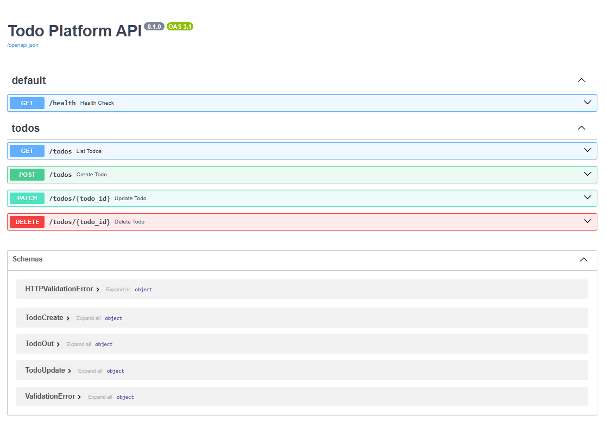
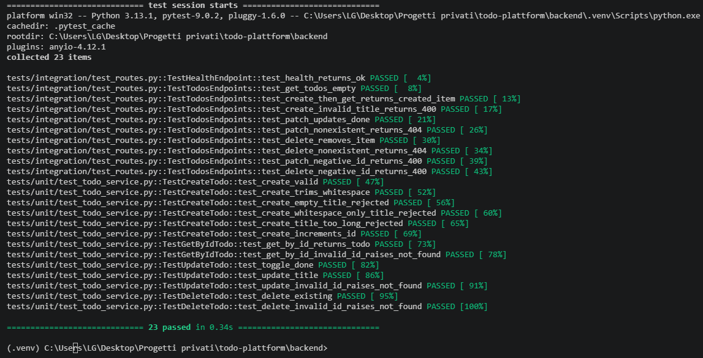

# Todo Platform API

> **Note:** This is a personal fork of [AlSweidanAhmad/todo-platform](https://github.com/AlSweidanAhmad/todo-platform).
> Changes to this README and the backend implementation do not affect the original repository.


A RESTful Todo API built with **FastAPI** and **SQLAlchemy 2.0**, backed by **SQLite**. Clean layered architecture with full CRUD support, input validation, and a comprehensive test suite.

---

## Screenshots

### API Documentation (Swagger UI)

<!-- Add a screenshot of http://localhost:8000/docs after starting the server -->


### Test Suite — 23/23 Passing

<!-- Run: cd backend && pytest -v, then screenshot the terminal output -->


---

## Features

- Full **CRUD** for todos: create, list, update (title + done), delete
- **Input validation**: empty titles, whitespace-only titles, titles > 200 chars are rejected
- **ISO 8601 UTC** timestamps on all responses (`"created_at": "2026-02-12T10:30:00Z"`)
- **CORS** configured for local frontend at `http://localhost:5173`
- Tables created automatically on startup via SQLAlchemy `Base.metadata.create_all`
- **23 tests** (unit + integration) using SQLite in-memory database

---

## Tech Stack

| Layer | Technology |
|---|---|
| Framework | FastAPI 0.115 |
| ORM | SQLAlchemy 2.0 |
| Database | SQLite (file: `todos.db`) |
| Validation | Pydantic 2.9 |
| Config | pydantic-settings |
| Server | Uvicorn |
| Testing | Pytest + HTTPX |
| Python | 3.13+ |

---

## Project Structure

```
todo-plattform/
├── backend/
│   ├── app/
│   │   ├── api/
│   │   │   ├── routes/
│   │   │   │   ├── health.py           # GET /health
│   │   │   │   └── todos.py            # CRUD /todos
│   │   │   ├── dependencies.py         # Dependency injection
│   │   │   └── router.py               # Central API router
│   │   ├── core/
│   │   │   └── config.py               # Settings + .env support
│   │   ├── db/
│   │   │   ├── base.py                 # SQLAlchemy Base
│   │   │   └── session.py              # Engine + get_db()
│   │   ├── models/
│   │   │   └── todo_model.py           # ORM model
│   │   ├── repositories/
│   │   │   └── todo_repository.py      # Data access layer
│   │   ├── schemas/
│   │   │   └── todo.py                 # Pydantic DTOs
│   │   ├── services/
│   │   │   └── todo_service.py         # Business logic
│   │   ├── exceptions.py               # Custom errors
│   │   └── main.py                     # Entry point (lifespan)
│   ├── tests/
│   │   ├── integration/
│   │   │   └── test_routes.py          # API tests (10)
│   │   ├── unit/
│   │   │   └── test_todo_service.py    # Service tests (13)
│   │   └── conftest.py                 # Fixtures
│   └── requirements.txt
├── docs/
│   ├── api-contract.md
│   └── screenshots/                    # Add screenshots here
└── frontend/                           # React frontend
```

---

## Installation & Setup

### Prerequisites

- Python 3.13+
- Git

### 1. Clone your fork

```bash
git clone https://github.com/MihaelaAghirculesei/todo-platform.git
cd todo-platform/backend
```

### 2. Create and activate a virtual environment

```bash
python -m venv .venv

# Windows
.venv\Scripts\activate

# macOS / Linux
source .venv/bin/activate
```

### 3. Install dependencies

```bash
pip install -r requirements.txt
```

### 4. Start the server

```bash
uvicorn app.main:app --reload
```

The API will be available at `http://localhost:8000`.

---

## Environment Variables

All settings have defaults and work out of the box. Override via `.env` file inside `backend/`:

```env
APP_HOST=0.0.0.0
APP_PORT=8000
DATABASE_URL=sqlite:///./todos.db
CORS_ORIGINS=["http://localhost:5173"]
```

---

## API Reference

Interactive docs: **[http://localhost:8000/docs](http://localhost:8000/docs)**

### Endpoints

| Method | Path | Description |
|--------|------|-------------|
| `GET` | `/health` | Health check |
| `GET` | `/todos` | List all todos |
| `POST` | `/todos` | Create a todo |
| `PATCH` | `/todos/{id}` | Update title and/or done status |
| `DELETE` | `/todos/{id}` | Delete a todo |

---

## Request / Response Examples

### Health check

```bash
curl http://localhost:8000/health
```

```json
{ "status": "ok" }
```

---

### Create a todo

```bash
curl -X POST http://localhost:8000/todos \
  -H "Content-Type: application/json" \
  -d '{"title": "Buy groceries"}'
```

```json
{
  "id": 1,
  "title": "Buy groceries",
  "done": false,
  "created_at": "2026-04-24T09:15:00Z"
}
```

---

### List all todos

```bash
curl http://localhost:8000/todos
```

```json
[
  {
    "id": 1,
    "title": "Buy groceries",
    "done": false,
    "created_at": "2026-04-24T09:15:00Z"
  }
]
```

---

### Update a todo (mark as done)

```bash
curl -X PATCH http://localhost:8000/todos/1 \
  -H "Content-Type: application/json" \
  -d '{"done": true}'
```

```json
{
  "id": 1,
  "title": "Buy groceries",
  "done": true,
  "created_at": "2026-04-24T09:15:00Z"
}
```

---

### Update a todo (rename)

```bash
curl -X PATCH http://localhost:8000/todos/1 \
  -H "Content-Type: application/json" \
  -d '{"title": "Buy groceries and milk"}'
```

---

### Delete a todo

```bash
curl -X DELETE http://localhost:8000/todos/1
```

`204 No Content` — no response body.

---

### Error responses

```bash
# Empty title → 400
curl -X POST http://localhost:8000/todos \
  -H "Content-Type: application/json" \
  -d '{"title": ""}'
```

```json
{ "detail": "Title must be between 1 and 200 characters." }
```

```bash
# Non-existent ID → 404
curl -X PATCH http://localhost:8000/todos/999 \
  -H "Content-Type: application/json" \
  -d '{"done": true}'
```

```json
{ "detail": "Todo with id 999 not found." }
```

---

## Running Tests

```bash
cd backend
pytest -v
```

Expected output: **23 passed**.

```
tests/integration/test_routes.py::TestHealthEndpoint::test_health_returns_ok PASSED
tests/integration/test_routes.py::TestTodosEndpoints::test_get_todos_empty PASSED
tests/integration/test_routes.py::TestTodosEndpoints::test_create_then_get_returns_created_item PASSED
tests/integration/test_routes.py::TestTodosEndpoints::test_create_invalid_title_returns_400 PASSED
tests/integration/test_routes.py::TestTodosEndpoints::test_patch_updates_done PASSED
tests/integration/test_routes.py::TestTodosEndpoints::test_patch_nonexistent_returns_404 PASSED
tests/integration/test_routes.py::TestTodosEndpoints::test_delete_removes_item PASSED
tests/integration/test_routes.py::TestTodosEndpoints::test_delete_nonexistent_returns_404 PASSED
tests/integration/test_routes.py::TestTodosEndpoints::test_patch_negative_id_returns_400 PASSED
tests/integration/test_routes.py::TestTodosEndpoints::test_delete_negative_id_returns_400 PASSED
tests/unit/test_todo_service.py::TestCreateTodo::test_create_valid PASSED
tests/unit/test_todo_service.py::TestCreateTodo::test_create_trims_whitespace PASSED
tests/unit/test_todo_service.py::TestCreateTodo::test_create_empty_title_rejected PASSED
tests/unit/test_todo_service.py::TestCreateTodo::test_create_whitespace_only_title_rejected PASSED
tests/unit/test_todo_service.py::TestCreateTodo::test_create_title_too_long_rejected PASSED
tests/unit/test_todo_service.py::TestCreateTodo::test_create_increments_id PASSED
tests/unit/test_todo_service.py::TestGetByIdTodo::test_get_by_id_returns_todo PASSED
tests/unit/test_todo_service.py::TestGetByIdTodo::test_get_by_id_invalid_id_raises_not_found PASSED
tests/unit/test_todo_service.py::TestUpdateTodo::test_toggle_done PASSED
tests/unit/test_todo_service.py::TestUpdateTodo::test_update_title PASSED
tests/unit/test_todo_service.py::TestUpdateTodo::test_update_invalid_id_raises_not_found PASSED
tests/unit/test_todo_service.py::TestDeleteTodo::test_delete_existing PASSED
tests/unit/test_todo_service.py::TestDeleteTodo::test_delete_invalid_id_raises_not_found PASSED

23 passed
```

> Tests run against an **SQLite in-memory database** — no file written, no cleanup needed.

---

## Architecture

```
HTTP Request
     │
     ▼
 FastAPI Router  (app/api/routes/)
     │
     ▼
 TodoService     (app/services/)      ← business logic, validation
     │
     ▼
 TodoRepository  (app/repositories/)  ← data access, SQLAlchemy queries
     │
     ▼
 SQLite DB       (todos.db)
```

---

## Contributors

| Name | Role | GitHub |
|------|------|--------|
| **Mihaela Aghirculesei** | Backend implementation, SQLAlchemy layer, test suite | [@MihaelaAghirculesei](https://github.com/MihaelaAghirculesei) |
| **Ahmad Al Sweidan** | Original project author, frontend | [@AlSweidanAhmad](https://github.com/AlSweidanAhmad) |

---

*Personal fork — README changes are local to this repository and do not affect [AlSweidanAhmad/todo-platform](https://github.com/AlSweidanAhmad/todo-platform).*
